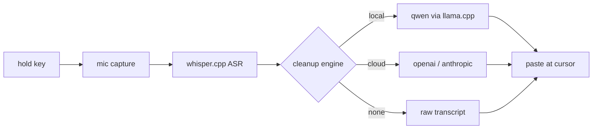

```
 ██╗    ██╗██╗  ██╗██╗███╗   ███╗██████╗ ██████╗ ███████╗██╗      ██████╗ ██╗    ██╗
 ██║    ██║██║  ██║██║████╗ ████║██╔══██╗██╔══██╗██╔════╝██║     ██╔═══██╗██║    ██║
 ██║ █╗ ██║███████║██║██╔████╔██║██████╔╝██████╔╝█████╗  ██║     ██║   ██║██║ █╗ ██║
 ██║███╗██║██╔══██║██║██║╚██╔╝██║██╔═══╝ ██╔══██╗██╔══╝  ██║     ██║   ██║██║███╗██║
 ╚███╔███╔╝██║  ██║██║██║ ╚═╝ ██║██║     ██║  ██║██║     ███████╗╚██████╔╝╚███╔███╔╝
  ╚══╝╚══╝ ╚═╝  ╚═╝╚═╝╚═╝     ╚═╝╚═╝     ╚═╝  ╚═╝╚═╝     ╚══════╝ ╚═════╝  ╚══╝╚══╝
```

<div align="center">

### `HOLD A KEY // SPEAK // TEXT LANDS`

*local-first voice dictation that actually works, built on whisper.cpp and stubbornness*

    

</div>

---

## 🎙️ What is this

WhimprFlow is a voice dictation app that runs entirely on your machine — macOS or Windows. Hold a key, speak, release. Clean text appears wherever your cursor was. No account, no subscription, no audio leaving your machine (unless you want it to).

Speech recognition runs on-device via Whisper (GPU-accelerated on Apple Silicon and NVIDIA GPUs, plain CPU anywhere else). A local Qwen model handles the cleanup pass: filler removal, spoken self-corrections, punctuation, paragraph formatting. Or skip the local model and point it at OpenAI, Anthropic, or any OpenAI-compatible API. Your call.

This is a polished fork of [Blueturboguy07's original](https://github.com/Blueturboguy07/WhimprFlow), merging the best community contributions into one build that works out of the box. The original was a proof of concept built for a short-form video. This fork is for people who actually want to use it every day.

```console
nick@whimprflow:~$ fn (hold) → "schedule the meeting for thursday at three"
[✓] Schedule the meeting for Thursday at 3.
[i] 8 words. 0.4s cleanup. your fingers did nothing.
```

## 🧩 The dictation pipeline

| | feature | what it actually does |
|---|---|---|
| 01 | **on-device ASR** | whisper.cpp (Metal on Apple Silicon, CUDA/CPU on Windows), transcribes speech without a network connection |
| 02 | **local LLM cleanup** | qwen 4B removes fillers, fixes "no wait" self-corrections, adds punctuation |
| 03 | **cloud cleanup** | optional: openai, anthropic, or any compatible API for the cleanup pass |
| 04 | **multi-language** | speak greek, get english text (or any of whisper's 99 languages) |
| 05 | **floating pill** | always-on-top overlay, visible on all Spaces/desktops, click-through with hover actions |
| 06 | **push-to-talk** | configurable: fn, right cmd, right opt, right ctrl on macOS; right ctrl on Windows |
| 07 | **auto-learn dictionary** | watches for one-word corrections after paste, learns names and terms |
| 08 | **dark/light theming** | follows system or manual toggle, no flash on launch |
| 09 | **dock toggle** | menu-bar/tray-only mode or full dock/desktop app, your preference |
| 10 | **shortcuts pane** | displays all keyboard shortcuts in one place |

## 🚀 Run it

### macOS

Grab the DMG from the [latest release](https://github.com/nitrimandylis/WhimprFlow/releases/latest). The app is unsigned, so on first launch: right-click > Open, or run `xattr -cr /Applications/WhimprFlow.app`.

Or build from source:

```bash
# prerequisites: rust (stable), node, pnpm, cmake, xcode cli tools
git clone https://github.com/nitrimandylis/WhimprFlow.git
cd WhimprFlow && cd ui && pnpm install && cd ..
./dev.sh
```

On Windows, from a PowerShell prompt:

```powershell
# prerequisites: rust (stable), node, pnpm, Visual Studio Build Tools (Desktop
# development with C++), and LLVM/clang ≤ 18.x (not "latest" — see
# docs/BUILD-PREREQUISITES.md)
git clone https://github.com/nitrimandylis/WhimprFlow.git
cd WhimprFlow && cd ui && pnpm install && cd ..
.\dev.ps1
```

`dev.ps1` locates the MSVC environment automatically via vswhere, runs the
LLVM/clang preflight check, builds and stages the LLM worker, then starts the
app with hot reload. Models live in `%APPDATA%\WhimprFlow\models\`.

First launch walks you through Accessibility and Microphone permissions, then lets you pick and download a Whisper model from inside the app. The `ggml-large-v3-turbo` (1.6 GB) is the sweet spot for Apple Silicon. You can also drop a `.bin` into `~/Library/Application Support/WhimprFlow/models/` manually. See [docs/MODELS.md](docs/MODELS.md) for download links.

Grant both permissions, hold Fn, talk.

If double-tapping Fn opens Apple's own Dictation instead of locking a hands-free session, turn that shortcut off: System Settings → Keyboard → Dictation → Shortcut → Off, and set "Press 🌐 key to" → Do Nothing.

### Windows

Grab the installer from the [latest release](https://github.com/nitrimandylis/WhimprFlow/releases/latest). Windows builds ship as an MSI/NSIS installer — no special launch steps required.

Or build from source:

```powershell
# prerequisites: rust (stable), node, pnpm, cmake, Visual Studio Build Tools (MSVC C++ workload)
git clone https://github.com/nitrimandylis/WhimprFlow.git
cd WhimprFlow
cd ui; pnpm install; cd ..

# dev.sh equivalent: build and stage the local-LLM worker, then launch the app
# (tauri dev only builds the app crate, so the sidecar must be staged manually)
$triple = (rustc -vV | Select-String '^host: ').Line -replace '^host: ', ''
cargo build -p whimpr-llm-worker
Copy-Item "target\debug\whimpr-llm-worker.exe" "src-tauri\binaries\whimpr-llm-worker-$triple.exe" -Force
ui\node_modules\.bin\tauri dev
```

First launch walks you through microphone permission — in Settings → Privacy & security → Microphone, make sure "Allow desktop apps to access your microphone" is on — then lets you pick and download a Whisper model from inside the app. The `ggml-large-v3-turbo` (1.6 GB) is the sweet spot; on machines without NVIDIA hardware, try `ggml-base` or `ggml-small` for faster CPU transcription. You can also drop a `.bin` into `%APPDATA%\WhimprFlow\models\` manually. See [docs/MODELS.md](docs/MODELS.md) for download links.

Grant the permission, hold Right Ctrl, talk.

### Where things live

| | macOS | Windows |
|---|---|---|
| settings, dictionary, stats, history | `~/Library/Application Support/WhimprFlow/` | `%APPDATA%\WhimprFlow\` |
| API keys | macOS keychain | Windows Credential Manager |

The text of your last 500 dictations is kept on disk for the Hub's history list; turn that off in Settings → History if you would rather keep only the word counts. API keys never touch a file.

## 🔩 Under the hood



| layer | path | job |
|---|---|---|
| whimpr-core | `crates/whimpr-core/` | state machine, cleanup prompts and gates, dictionary, stats |
| whimpr-asr | `crates/whimpr-asr/` | whisper.cpp bindings, model loading |
| whimpr-audio | `crates/whimpr-audio/` | mic capture, resampling to 16kHz mono |
| whimpr-cleanup | `crates/whimpr-cleanup/` | openai and anthropic cloud providers |
| whimpr-llm-worker | `crates/whimpr-llm-worker/` | sidecar process running llama.cpp |
| tauri shell | `src-tauri/` | hotkey hook, paste injection, tray, permissions |
| hub + pill | `ui/` | react settings hub and overlay pill (two separate webviews) |

**Stack:** Tauri v2 · Rust · React · TypeScript · whisper.cpp · llama.cpp · Metal / CUDA / CPU

## 🙏 Credits

| who | what |
|---|---|
| [**Blueturboguy07**](https://github.com/Blueturboguy07) | original whimprflow, the whole idea |
| [**patelvraj810**](https://github.com/patelvraj810) | PR #4: dock toggle, pill fixes, multi-lang, push-to-talk, new panes |
| [**ch1kim0n1**](https://github.com/ch1kim0n1) | PR #2: dark/light theming, GSAP motion, app icon, shortcuts pane |
| PR #6 author | key saving fix, settings debounce, single-instance guard |
| PR #8 author | layout-cue word deletion fix |
| PR #9 author | accessibility self-heal, pill hiding, cleanup worker wiring |

---

<div align="center">

**[Nick Trimandylis](https://github.com/nitrimandylis)**

`HOLD THE KEY, SAY THE THING, LET GO`

MIT licensed. Fork of [Blueturboguy07/WhimprFlow](https://github.com/Blueturboguy07/WhimprFlow).

</div>
